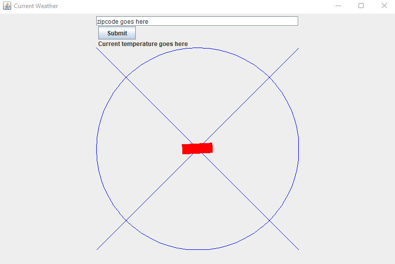

# nemesure-mco152-2022

This is a repository for my classwork for MCO-152 Computer Methodology at Touro in 2022

This project uses:
- [Retrofit](https://square.github.io/retrofit/)
- Gson
- [Mockito](https://site.mockito.org/) 
- Junit
- Rx
- Gradle
- [Dagger](https://www.baeldung.com/dagger-2)

